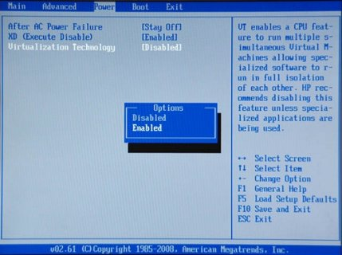

Instalando e Configurando o Docker
----------------------------------

.. _Pré-requisitos:

Pré-requesitos
~~~~~~~~~~~~~~

ANTES DE CONTINUAR Verifique se a virtualização está habilitada na BIOS

Desative o Hyper-V no Windows

Baixe a versão do `ToolBox`_ para seu sistema operacional e prossiga normalmente instalando todos os utilitários que este pacote oferece.

.. _Toolbox: https://docs.docker.com/toolbox/toolbox_install_windows

.. image:: ../imagem/docker.jpg
    :align: center

.. _Instalando o Docker:

Instalando o Docker
~~~~~~~~~~~~~~~~~~~

Após a instalação do ToolBox, você deverá conter em sua máquina as seguintes Aplicações: Docker, VirtualBox, Kinematic e o GIT.

Atualize o VirtualBox se necessário ou se desejar, a versão que acompanha o ToolKit funciona perfeitamente.

Prosseguiremos com a Instalação e Configuração do Container, que é basicamente nossa área de desenvolvimento, nos seguintes passos:

Kinematic

Assim, que completar a instalação, execute o Kinematic. 
Após isso, clique na opção de executar com o Virtual Box/VM. Ele irá iniciar o processo de criação de uma VM, pode ser que demore um pouco!

.. _Configurando o Docker:

Configurando o Docker
~~~~~~~~~~~~~~~~~~~~~

Após isso, será necessário que configuremos a porta USB que será utilizada para o flash do ESP8266.

Conecte na USB seu ESP8266.
Verifique se o Windows detectou corretamente seu ESP em Gerenciador de Dispositivos, ele deverá aparecer na parte de Portas COM.

É obrigatório possuir um ESP8266 conectado na USB antes de iniciar o Container, caso contrário não irá funcionar.

VirtualBox

Abra o Virtual Box, deverá ter uma máquina virtual chamada default. É por meio desta que o nosso docker funciona. 

Precisamos emular nosso dispositivo USB ( ESP8266 ) para dentro do Docker e iremos fazer isso através do VirtualBox mas para isso precisaremos parar a VM que está rodando, há duas maneiras de fazer isso:

Via Comando ( Recomendado )

Apertando botão direito na VM e realizar o desligamento. ( Não Recomendado )

Para desligar a VM via Comando, retorne ao Kinematic ( Aberto anteriormente ) e clique em Docker CLI, como mostra a figura abaixo:

O PowerShell ( Windows 10 ) ou CMD irá abrir. 

Digite o seguinte comando para parar a Maquina Virtual:

docker-machine stop

.. image:: ../imagem/powerShell.png
    :align: center

Após parar a VM, volte ao VirtualBox, abra a configuração da VM default e realize a emulação do USB onde seu ESP8266 está localizado, como mostra a figura abaixo:

Clique no USB com um + e selecione o dispositivo USB que corresponde ao seu ESP.

.. image:: ../imagem/oracle.png
    :align: center

Retorne ao PowerShell ou CMD e digite o seguinte comando para religar a Maquina Virtual:

docker-machine start

Note que caso você queira desligar/religar o ambiente de desenvolvimento, os mesmos comandos do docker-machine start/stop deverão utilizados.

Última Etapa

Não iremos mais utilizar o VirtualBox, portanto pode ser fechado. A partir dessa etapa, apenas o Docker CLI e o Kinematic são utilizados.

Crie uma pasta no seguinte caminho C:\Users\SeuNome\sming. ( Pasta que será compartilhada com o Container )

Atenção ao nome da pasta, o comando abaixo está configurado para funcionar somente com esse nome de pasta.

Seguindo todos esses passos, digite o último comando no PowerShell ou CMD:

docker pull automacaoiot/esp8266-sdk ; docker run -it -d -p 8181:80 -p 8122:22 -p 4075:4075 --device=//dev/ttyUSB0 -v /c/Users/$env:username/sming/:/workspace/shared-workspace/ automacaoiot/esp8266-sdk

    

Após isso, seu Container já estará pronto e configurado para uso. Agora é apenas programar !

Caso queira mudar a localização da pasta compartilhada, é só mudar o caminho no comando que está descrito em:

/c/Users/$env:username/sming/

Abrindo no Navegador

Ainda no Kinematic, note que apareceu um Container, de nome aleatório, clique nele e selecione Web Preview ao lado.

Observações

O Container só será inicializado ( Supondo que você tenha desligado e religado o computador ), caso o ESP8266 esteja conectado na USB. Após conectar é só apertar START no Kinematic.
Após iniciar o Container, é possível desconectar e conectar o ESP8266 da porta USB quantas vezes for necessário ou, supondo que você possua vários ESPs de mesmo modelo, trocar de dispositivo.

